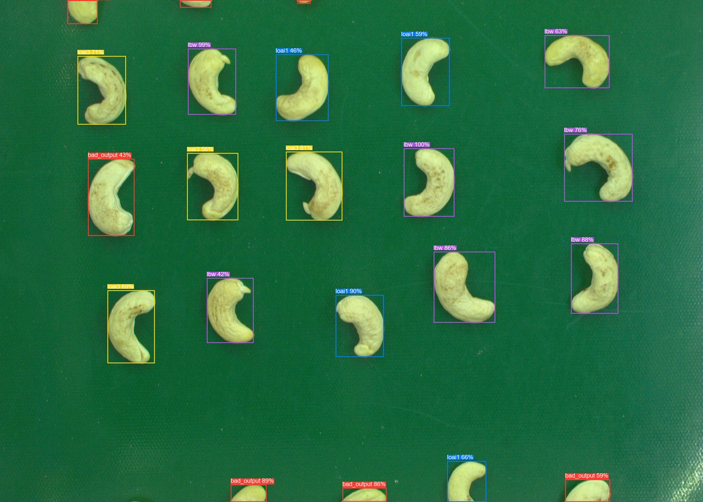
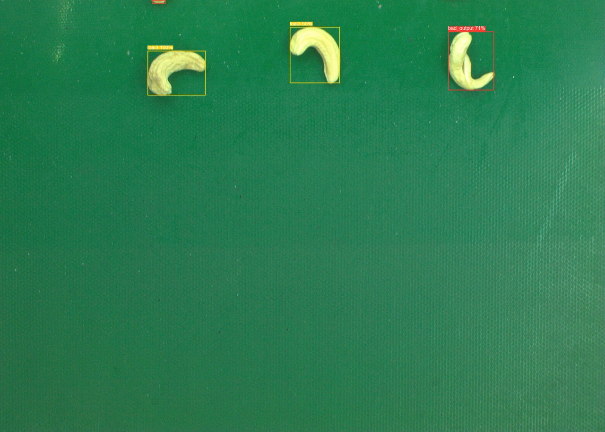
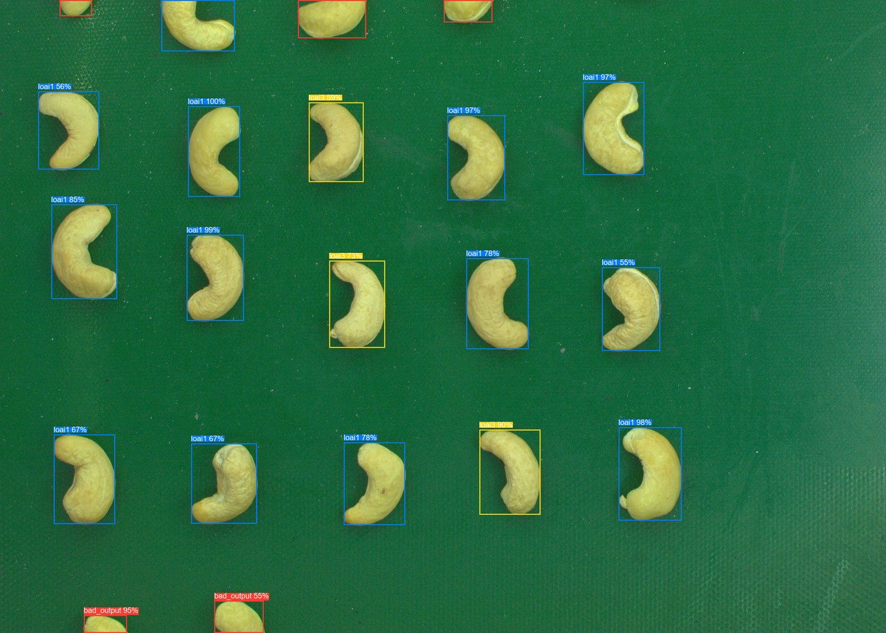
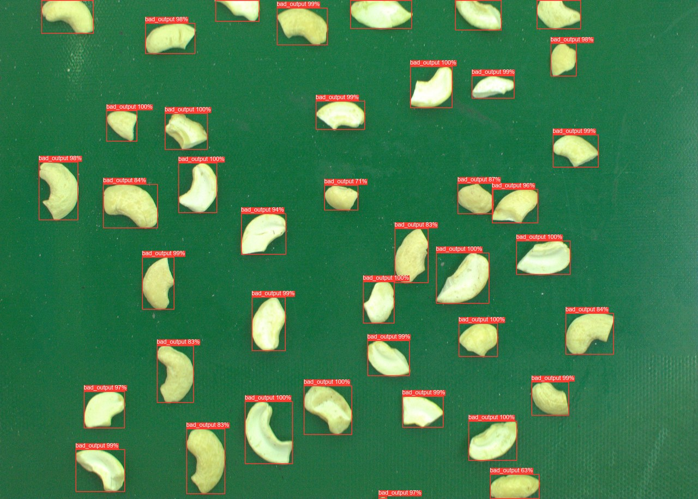

# Cashew Nut Grading — YOLOv8 + ResNet-50

Hệ thống phân loại hạt điều tự động gồm 2 model kết hợp theo pipeline:

1. **YOLOv8s** — detect và locate từng hạt điều trong ảnh
2. **ResNet-50** — phân loại chất lượng từng hạt đã được crop

---

## Demo

| | |
|---|---|
|  |  |
|  |  |

Màu bbox theo class:
- 🟢 `tb` &nbsp; 🔵 `loai1` &nbsp; 🔵 `loai2` &nbsp; 🟡 `loai3` &nbsp; 🟣 `lbw` &nbsp; 🔴 `bad_output`

---

## Classes

| Class | Mô tả |
|-------|--------|
| `tb`  | Tiêu biểu (standard) |
| `loai1` | Loại 1 |
| `loai2` | Loại 2 |
| `loai3` | Loại 3 |
| `lbw` | LBW |
| `bad_output` | Lỗi / hỏng |

---

## Model Files

| File | Mô tả | Format |
|------|--------|--------|
| `runs/yolo/cashew_detect/weights/best.pt` | YOLOv8s trained weights | Ultralytics |
| `yolo_cashew.pt` | YOLOv8s TorchScript export | TorchScript |
| `resnet50_cashew.pt` | ResNet-50 TorchScript (dùng cho inference) | TorchScript |
| `resnet50_cashew_weights.pt` | ResNet-50 state dict (dùng để resume training) | PyTorch |

---

## Pipeline

```
[Ảnh đầu vào]
      │
      ▼
  YOLOv8s detect
  (vị trí từng hạt)
      │
      ▼
  Crop từng bbox
      │
      ▼
  ResNet-50 classify
  (loại của hạt)
      │
      ▼
[Kết quả: vị trí + loại từng hạt]
```

---

## Kết quả Test

Test trên 5 ảnh từ validation set:

- **YOLO**: avg 27.8 hạt/ảnh, confidence 0.85–0.98
- **ResNet**: confidence >87% trên các crop từ YOLO
- **ResNet standalone**: 18/18 = 100% accuracy trên sample test

---

## Training

### YOLOv8

Dataset: Roboflow (1 class: `cashew`), 391 train / 98 val images

```bash
python train_yolo.py
# options
python train_yolo.py --model yolov8s.pt --epochs 100 --batch 16 --device 0
```

### ResNet-50

Dataset: 6-class classification, ~1820 ảnh tổng

Transfer learning 2 phases:
- Phase 1 (10 epochs): freeze backbone, chỉ train fc
- Phase 2 (30 epochs): fine-tune toàn bộ

```bash
python train_resnet.py
# options
python train_resnet.py --epochs_phase1 10 --epochs_phase2 30
```

---

## Test Pipeline

```bash
python test_models.py             # test 5 ảnh mặc định
python test_models.py --images 10 # test 10 ảnh
```

Yêu cầu thư mục `valid/images/` để chạy test.

---

## Requirements

```bash
pip install -r requirements.txt
```

```
torch
torchvision
ultralytics
tqdm
Pillow
```
